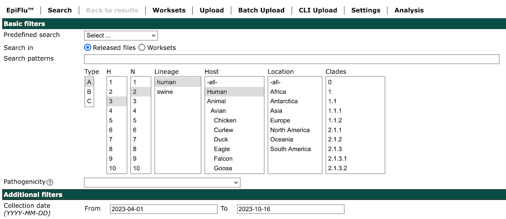
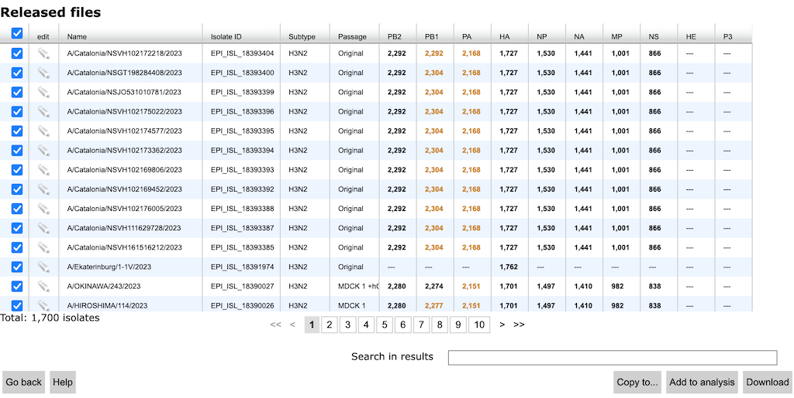
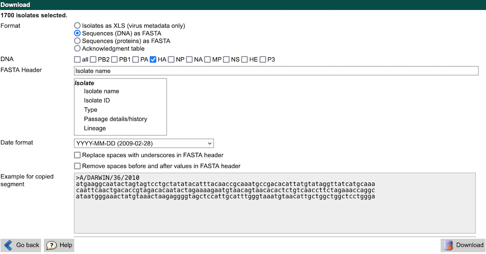

# NW-Page seasonal-flu 
This is the NW-PAGE Washington focused [Nextstrain](https://nextstrain.org)  build for seasonal influenza viruses, available online at [nextstrain.org/groups/wadoh/seasonal-flu](https://nextstrain.org/groups/wadoh/flu/seasonal/h3n2/WA/2y/ha). 
The build encompasses fetching data, preparing it for analysis, doing quality control,
performing analyses, and saving the results in a format suitable for visualization (with
[auspice][]). 

All influenza virus specific steps and functionality for the Nextstrain pipeline should be
housed in this repository.

This build is more complicated than other standard nextstrain builds because all three
currently circulating seasonal influenza lineages (A/H3N2, A/H1N1pdm, and B/Vic)
are analyzed using the same Snakefile with appropriate wildcards. In addition, we run
analyses of both the HA and NA segments of the influenza virus genome and analyze datasets
that span different time intervals (eg 2 & 3 years). While the build is capable of using antigenic 
and serological data to model fitness we currently do not incorporate these data in this build. 


# Input data requirements for running the Washington focused seasonal-flu build 

1. Sequence data from GISAID that has been cleaned and stored in a `data/` folder 
partitioned by pathogen. For example, for the three circulating seasonal influenza lineages: 
```
data/h3n2/raw_sequences_ha.fasta
data/h3n2/raw_sequences_na.fasta
data/h1n1pdm/raw_sequences_ha.fasta
data/h1n1pdm/raw_sequences_na.fasta
data/vic/raw_sequences_ha.fasta
data/vic/raw_sequences_na.fasta
``` 

2. Metadata from GISAID that has been cleaned and stored in a `data/` folder partitioned by pathogen. 
``` 
data/h3n2/metadata.xlsx
data/h1n1pdm/metadata.xlsx
data/vic/metadata.xlsx
```

# Running Washington focused seasonal-flu build 

After cloning the repo: 

```
cd seasonal-flu 
```

Run the Nextstrain workflow for the data to produce an annotated phylogenetic tree of recent A/H3N2, A/H1N1, and B/Vic HA and NA data
with the following command. 

```
nextstrain build . --configfile profiles/gisaid/builds_wadoh.yaml 
```

When the workflow finishes running, visualize the resulting tree with the following command. 
```
nextstrain view auspice 
```


## Example build

You can run an example build using the example data provided in this repository.

First follow the [standard installation instructions](https://docs.nextstrain.org/en/latest/install.html)
for Nextstrain's suite of software tools.

Then run the example build via:

```
nextstrain build .  --configfile profiles/example/builds.yaml
```

When the build has finished running, view the output Auspice trees via:

```
nextstrain view auspice/
```

## Quickstart with GISAID data

Navigate to [GISAID](http://gisaid.org).
Select the "EpiFlu" link in the top navigation bar and then select "Search" from the EpiFlu navigation bar.
From the search interface, select A/H3N2 human samples collected in the last six months, as shown in the example below.



Also, under the "Required Segments" section at the bottom of the page, select "HA".
Then select the "Search" button.
Select the checkbox in the top-left corner of the search results (the same row with the column headings), to select all matching records as shown below.



Select the "Download" button.
From the "Download" window that appears, select "Isolates as XLS (virus metadata only)" and then select the "Download" button.


Create a new directory for these data in the `seasonal-flu` working directory.

``` bash
mkdir -p data/h3n2/
```

Save the XLS file you downloaded (e.g., `gisaid_epiflu_isolates.xls`) as `data/h3n2/metadata.xls`.
Return to the GISAID "Download" window, and select "Sequences (DNA) as FASTA".
In the "DNA" section, select the checkbox for "HA".
In the "FASTA Header" section, enter only `Isolate name`.
Leave all other sections at the default values.



Select the "Download" button.
Save the FASTA file you downloaded (e.g., `gisaid_epiflu_sequences.fasta`) as `data/h3n2/raw_sequences_ha.fasta`.

Run the Nextstrain workflow for these data to produce an annotated phylogenetic tree of recent A/H3N2 HA data with the following command.

``` bash
nextstrain build . --configfile profiles/gisaid/builds.yaml
```

When the workflow finishes running, visualize the resulting tree with the following command.

``` bash
nextstrain view auspice
```

Explore the configuration file for this workflow by opening `profiles/gisaid/builds.yaml` in your favorite text editor.
This configuration file determines how the workflow runs, including how samples get selected for the tree.
Try changing the number of maximum sequences retained from subsampling from `100` to `500` and the geographic grouping from `region` to `country`.
Rerun your analysis by adding the `--forceall` flag to the end of the `nextstrain build` command you ran above.
How did those changes to the configuration file change the tree?

To skip subsampling and use all records that you downloaded from GISAID, set `filters` string in the build configuration file to an empty string as shown in the following subsection of the YAML file.

```yaml
      subsamples:
        global:
            filters: ""
```

Explore the other configuration files in `profiles/`, to see other examples of how you can build your own Nextstrain workflows for influenza.

## History

 - Prior to March 31, 2023, we selected strains for each build using a custom Python script called [select_strains.py](https://github.com/nextstrain/seasonal-flu/blob/64b5204d23c0b95e4b06f943e4efb8db005759c0/scripts/select_strains.py). With the merge of [the refactored workflow](https://github.com/nextstrain/seasonal-flu/pull/76), we have since used a configuration file to define the `augur filter` query logic we want for strain selection per build.

[Nextstrain]: https://nextstrain.org
[fauna]: https://github.com/nextstrain/fauna
[augur]: https://github.com/nextstrain/augur
[auspice]: https://github.com/nextstrain/auspice
[snakemake cli]: https://snakemake.readthedocs.io/en/stable/executable.html#all-options
[nextstrain-cli]: https://github.com/nextstrain/cli
[nextstrain-cli README]: https://github.com/nextstrain/cli/blob/master/README.md
